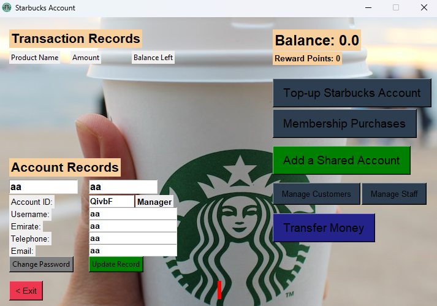

# Electronic-Starbucks-System

This project requires the creation of an assumed computerized Starbucks administration system. The code will run through a GUI interface. The system is a safe and convenient place to perform online access for users’ account info and records, memberships purchases (assume you can perform), and top-up their “StarbucksAccounts”.

## UI Samples

Registeration:


Login:


Dashboard:



Top up:


Transaction history:


Membership Purchases:


Purchase history:


Funds Transfer:


Transfer history:


Invalid purchase amount:


Invalid transfer amount:


Forbidden request:


## UML Class Diagram


## User Types

1) Manager

2) Staff

3) Customer

## Installation

1) Download <a href="https://www.python.org/downloads/">python</a> and esure it's added to the environment path variable.

2) Clone the repository.

3) cd Electronic-Starbucks-System/

4) $ ```python launcher.py```

## Requirements

- Python

## Tested On

- Windows 11 pro

- Python 3.10.10

## Tools

- Programming Language: **Python**

- Frontend (GUI): **Python Tkinter**

- UML: **Umlet**

- IDE: **Visual Studio (VS) Code**

- VCS: **Git**